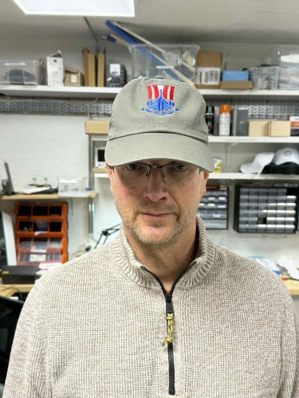

# Embroidery

## About the workshop

This workshop was mostly in Karen´s hands. She began by teaching others how to prepaire files and use the embroidery machine. Later on the participants assisted others. This was a flowing workshop throughout the whole bootcamp. 

## The embroidery machine

!!!note "Brother PR680W 6-Needle embroidery machine"

    The [Brother PR680W 6-Needle embroidery machine](https://sewingcraft.brother.eu/en/products/machines/semi-pro-embroidery-machines/semi-pro-embroidery-machines/pr680w) machine was used to embroider caps.

## Workflow

!!!success "Different workflows"

    Some used the [PE-Design](https://www.brother-usa.com/products/pedesign11) while others used the [InkStitch extension](https://inkstitch.org/) in Inkscape to prepare a design for embroidery.

