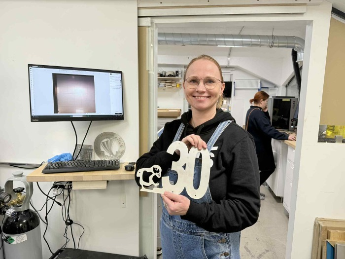
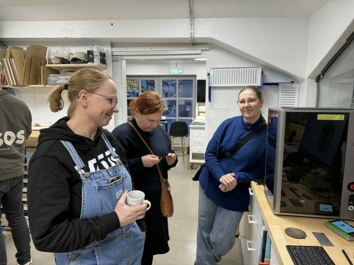
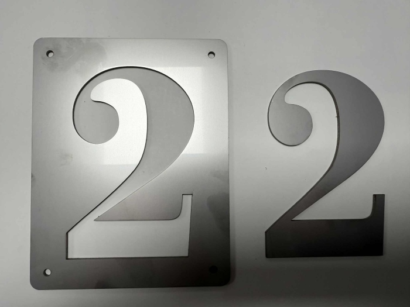
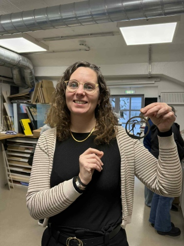

# xTool MetalFab and xTool F2

## About the workshop

The workshop...

## The machines

!!!note "The..."

    Use this format for links:
    [text here..](https://www.risoprinter.de/en/products/screen-printing/riso-miscreen-a4) machine was used to create the silkscreen.

## Workflow

!!!success "?"

    Use 

      

